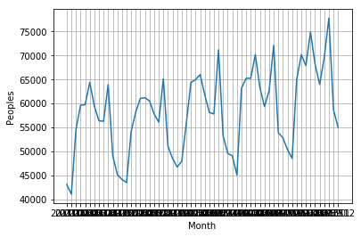

Python class *__8__*
===

### *__공공 데이터__*

### *__해외방문객정보__*

이번 수업에서는 각 나라별로 해외방문객정보를 json파일로 저장하는 내용을 배워보겠습니다.
<br>

#### *__datetime__*
`datetime`은 날짜시간에 대한 처리를 도와주는 라이브러리입니다.

```python
import urllib.request
import json
import datetime
```
<br>

#### *__get_request_url__*
이번에도 url을 요청하기 위해 `get_request_url`를 선언하였습니다.
이전과 차이점은 url을 요청할때 마다 `datetime.datetime.now()`함수를 통해 현재 날짜와 시간을 출력하도록 합니다.

```python
def get_request_url(url):
    req = urllib.request.Request(url)

    try:
        response = urllib.request.urlopen(req)
        if response.getcode() == 200:
            print ("[%s] Url Request Success" % datetime.datetime.now())
            return response.read().decode('utf-8')
    except Exception as e:
        print(e)
        print("[%s] Error for URL : %s" % (datetime.datetime.now(), url))
        return None
```

<br>

#### *__getNatVisitor__*
국가별 방문객정보를 `get_request_url`을 통해 얻어서 json 형식으로 데이터를 리턴해주는 함수입니다.

```python
def getNatVisitor(yyyymm, nat_cd, ed_cd):
    access_key ="lUb6ajXWCK0qhkX2v7TMP2TtcGNlJXgtfyoipeGaet9JEpCSgg6CNfqzWN%2BABnLF9gTFVgAtjNQe5Kh2ohxzyQ%3D%3D"
    end_point = "http://openapi.tour.go.kr/openapi/service/EdrcntTourismStatsService/getEdrcntTourismStatsList"

    parameters = "?_type=json&serviceKey=" + access_key
    parameters += "&YM=" + yyyymm
    parameters += "&NAT_CD=" + nat_cd
    parameters += "&ED_CD=" + ed_cd

    url = end_point + parameters

    retData = get_request_url(url)

    if (retData == None):
        return None
    else:
        return json.loads(retData)
```

<br>

#### *__#main__*
`main`이라는 이름으로 함수 선언을 하진 않았지만 아래 코드는 main에 해당합니다.
국가별 코드에 따라 각 나라의 해외방문객 정보를 json파일로 생성하는 코드입니다.
```python
#def main():

jsonResult = []

    #중국: 112/ 일본: 130/ 미국: 275
national_code ="275"

ed_cd = "E"

nStartYear = 2011
nEndYear = 2016
for year in range(nStartYear, nEndYear):
    for month in range(1, 13):

        yyyymm = "%04d%02d" % (year,month)
        jsonData = getNatVisitor(yyyymm, national_code, ed_cd)

        if (jsonData['response']['header']['resultMsg'] == 'OK'):
            krName = jsonData['response']['body']['items']['item']['natKorNm']
            krName = krName.replace(' ', '')
            iTotalVisit = jsonData['response']['body']['items']['item']['num']
            jsonResult.append({'nat_name':krName, 'nat_cd':national_code,
                              'yyyymm':yyyymm, 'visit_cnt':iTotalVisit})
        else:
            krName=''
            break

cnVisit = []
VisitYM = []
index = []
i = 0
for item in jsonResult:
    index.append(i)
    cnVisit.append(item['visit_cnt'])
    VisitYM.append(item['yyyymm'])
    i = i +1

with open('%s(%s)_해외방문객정보_%d_%d.json' % (krName, national_code, nStartYear, nEndYear-1),
         'w', encoding='utf-8') as outfile:
    retJson = json.dumps(jsonResult,
                        indent = 4, sort_keys = True,
                        ensure_ascii = False)
    outfile.write(retJson)
```

    [2017-10-23 15:47:43.257234] Url Request Success
    [2017-10-23 15:47:43.366379] Url Request Success
    [2017-10-23 15:47:43.476094] Url Request Success
    [2017-10-23 15:47:43.576388] Url Request Success
    [2017-10-23 15:47:43.683181] Url Request Success
    [2017-10-23 15:47:43.777459] Url Request Success
    [2017-10-23 15:47:43.876275] Url Request Success
    [2017-10-23 15:47:43.978328] Url Request Success
    [2017-10-23 15:47:44.095168] Url Request Success
    [2017-10-23 15:47:44.245094] Url Request Success
    [2017-10-23 15:47:44.353292] Url Request Success
    [2017-10-23 15:47:44.458219] Url Request Success
    [2017-10-23 15:47:44.573299] Url Request Success
    [2017-10-23 15:47:44.677136] Url Request Success
    [2017-10-23 15:47:44.780167] Url Request Success
    [2017-10-23 15:47:44.875965] Url Request Success
    [2017-10-23 15:47:44.977102] Url Request Success
    [2017-10-23 15:47:45.074991] Url Request Success
    [2017-10-23 15:47:45.175962] Url Request Success
    [2017-10-23 15:47:45.276366] Url Request Success
    [2017-10-23 15:47:45.376499] Url Request Success
    [2017-10-23 15:47:45.496074] Url Request Success
    [2017-10-23 15:47:45.605268] Url Request Success
    [2017-10-23 15:47:45.708281] Url Request Success
    [2017-10-23 15:47:45.795188] Url Request Success
    [2017-10-23 15:47:45.906367] Url Request Success
    [2017-10-23 15:47:46.277405] Url Request Success
    [2017-10-23 15:47:46.605191] Url Request Success
    [2017-10-23 15:47:46.977903] Url Request Success
    [2017-10-23 15:47:47.080326] Url Request Success
    [2017-10-23 15:47:47.188706] Url Request Success
    [2017-10-23 15:47:47.295178] Url Request Success
    [2017-10-23 15:47:47.396238] Url Request Success
    [2017-10-23 15:47:47.495172] Url Request Success
                        ...
    [2017-10-23 15:47:48.977228] Url Request Success
    [2017-10-23 15:47:49.247294] Url Request Success
    [2017-10-23 15:47:49.337431] Url Request Success
    [2017-10-23 15:47:49.436276] Url Request Success
    [2017-10-23 15:47:49.535244] Url Request Success
    [2017-10-23 15:47:49.636136] Url Request Success
    [2017-10-23 15:47:49.735646] Url Request Success
    [2017-10-23 15:47:49.845060] Url Request Success
    [2017-10-23 15:47:49.947537] Url Request Success
    [2017-10-23 15:47:50.045055] Url Request Success
    [2017-10-23 15:47:50.146072] Url Request Success
    [2017-10-23 15:47:50.245243] Url Request Success
    [2017-10-23 15:47:50.347074] Url Request Success
    [2017-10-23 15:47:50.445201] Url Request Success
    [2017-10-23 15:47:50.546368] Url Request Success


<br>

#### *__matplotlib__*
`matplotlib`은 다양한 하드 카피 형식과 다양한 플랫폼에서 상호작용 환경으로 출판 품질 수치를 생성하는
Python 2D 플로팅 라이브러리입니다. 위에서 생성한 각 나라별 해외방문객정보를 그래프화 시키기 위해 `import`합니다.
x축 라벨은 'Month', y축 라벨은 'Peoples'로 선언하였고, x축은 `VisitYM`, y축은 `cnVisit`을 할당하였습니다.

```python
import matplotlib.pyplot as plt
import matplotlib
from matplotlib import font_manager, rc
```

```python
plt.xticks(index, VisitYM)
plt.plot(index,cnVisit)
plt.xlabel('Month')
plt.ylabel('Peoples')
plt.grid(True)
plt.show()
```



